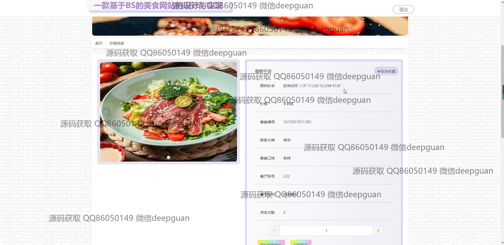

<h1 align="center">一款基于BS的美食网站的设计与实现</h1>

## 简介
美食网站基于BS架构，采用Spring Boot开发，角色分为管理员、餐厅、用户；主要功能包括餐厅和美食信息管理、订单和公告管理、用户注册登录、在线订餐及充值功能，提升用户体验。    --计算机毕业设计源码；毕设源码；java毕业设计源码

## 联系方式

<h3 align="center">获取完整代码与数据库文件 + 微信：deepguan QQ: 86050149 QQ群: 783742310</h3>

<h3 align="center">可帮忙远程部署 包运行成功！提供远程部署、修改代码、设计文档指导、代码讲解等服务！</h3>

## 功能介绍（完整见运行截图）
管理员：基本功能包括登录、注册和退出。网站后台管理涵盖餐厅信息管理、美食信息管理、订单管理、公告资讯编辑和美食文化管理。管理员可通过富文本编辑器进行内容输入，上传餐厅或美食图片并进行详细信息描述，管理用户信息和订单状态，查看订单、地址和收藏功能。页面导航包括个人中心、餐厅管理、用户管理和美食文化管理模块。

餐厅商家：餐厅商家可以使用专属的管理界面来更新和维护餐厅信息，包括名称、位置和联系方式等，上传或编辑餐厅封面，管理店内美食信息。餐厅商家需登录平台来管理订单，从而高效处理顾客的需求。订单管理模块允许查看不同状态的订单，利于餐厅在日常运作中快速响应。

普通用户：主要功能包括登录、注册和账户管理，用户可以在美食网站的首页浏览推荐美食并查看详细信息。用户有权限管理个人订单，通过个人中心查询订单历史和管理当前订单状态。在线购物功能允许用户选择餐品进行结算，并可通过多种支付方式完成充值和付款。

顾客：顾客能够进行注册以获取个性化的购物体验。功能包括查看餐厅详情、浏览不同美食、添加菜品至购物车以及在线订购。用户界面提供便捷的搜索和导航功能，让顾客可轻松访问不同美食和餐厅信息。顾客可以在下单后追踪订单状态，选择配送地址并备注需求。

## 运行截图

本代码来源于网络,仅供学习参考使用!

